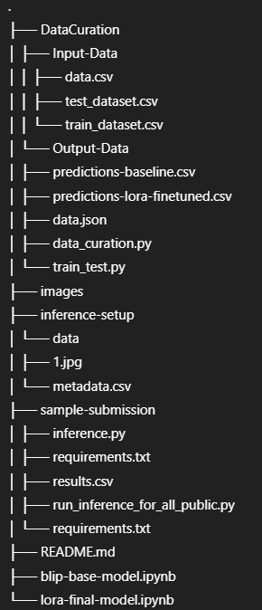
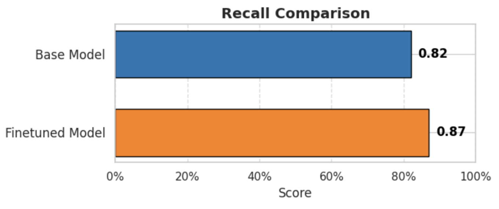
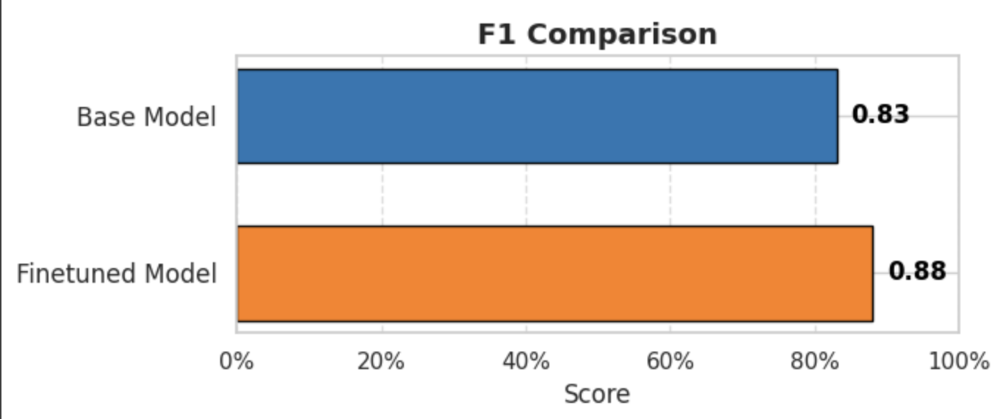

# Visual Question Answering with BLIP-vqa-base and LoRA Fine-Tuning

This project enables Visual Question Answering (VQA) using the BLIP-vqa-base model. It includes dataset preparation, baseline evaluation, fine-tuning with LoRA, and inference using the fine-tuned model.

---

## 📁 Project Structure

---

## 🔧 1. Dataset Curation

This step generates the train_dataset.csv and test_dataset.csv required for baseline evaluation and fine-tuning.

### Required Inputs:
- `abo-images-small.tar` or extracted images: `extracted-folder/images/small/`
- `images.csv.gz`
- `listings_*.json.gz` files from the [ABO dataset](https://github.com/google-research/google-research/tree/master/attribute-based-object-representations)

### Steps:
1. Place all required ABO dataset files in an accessible location.
2. Run `data_curation.py`:
   - Requires Gemini API key.
   - Produces:
     - `data.json`: raw Q&A pairs.
3. Run `train_test.py`:
   - Generates final train and test datasets: `train_dataset.csv` and `test_dataset.csv`.

---

## Train-Test Split
An 80-20 train-test split divides the data so 80% is used to train the model and 20% to test its performance. This balance ensures the model learns well while providing enough unseen data to evaluate how accurately it generalizes to new inputs. It’s a simple and effective method to validate machine learning models.

## Baseline Model Evaluation

The `Salesforce/blip-vqa-base` model is a vision-language model optimized for Visual Question Answering (VQA) tasks. It uses the BLIP (Bootstrapped Language-Image Pretraining) framework, which integrates visual and textual information to understand and answer questions about images. The `BlipProcessor` handles the preprocessing of both the image and the question, converting them into the appropriate format required by the model.

The `BlipForQuestionAnswering` class performs the core inference, generating accurate answers based on the input image and question. By loading the model onto the appropriate device (e.g., GPU), users can achieve efficient and fast performance. This makes the model well-suited for a range of applications such as automated image analysis, interactive AI systems, and accessibility tools. Ultimately, this model enables deeper visual comprehension through natural language interaction.

The `Salesforce/blip-vqa-base` model offers an excellent balance of performance and efficiency compared to several other popular VQA models. For instance, **VilBERT** was one of the earlier vision-language models based on a dual-stream transformer architecture. While it helped pioneer multimodal learning, VilBERT is relatively large, resource-intensive, and slower in inference compared to more recent models like BLIP.

Compared to **BLIP-2**, which is a more advanced successor designed for zero-shot capabilities and uses a frozen language model (e.g., T5 or OPT), the **BLIP-vqa-base** model is smaller and better suited for lightweight deployment where high throughput and low latency are important. Although BLIP-2 offers stronger zero-shot generalization, it comes at the cost of increased model size and complexity.

Even in comparison to the original **BLIP**, the `blip-vqa-base` model is optimized specifically for VQA tasks, making it more focused and efficient for such use cases. Overall, it provides a practical middle ground—offering better performance than older models like VilBERT and smaller size than models like BLIP-2, while maintaining accuracy and speed ideal for real-world VQA systems.

## Metrics
### Bert Score

### Precision

### Recall

### F1

